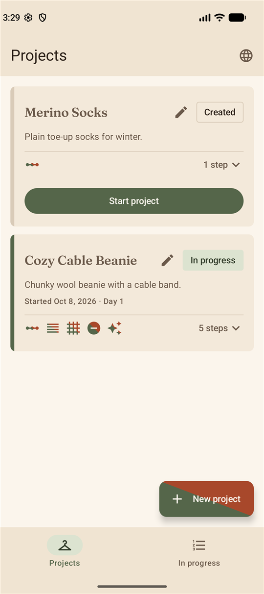
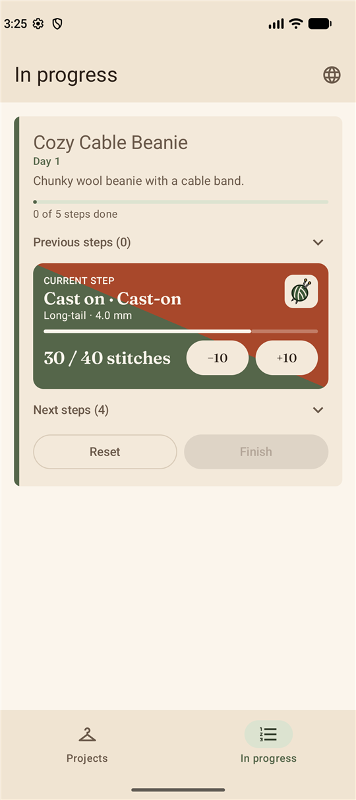
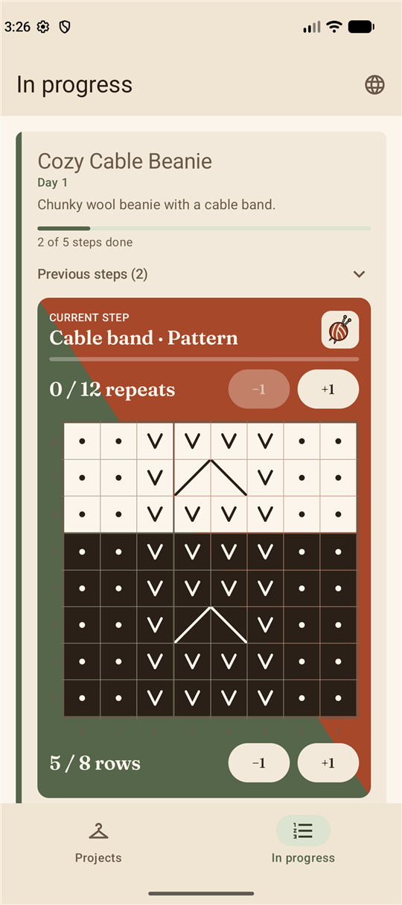
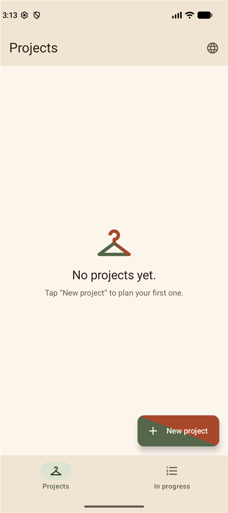
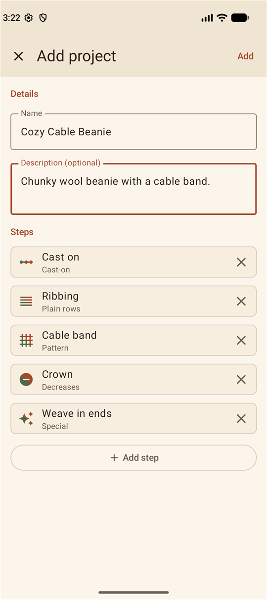
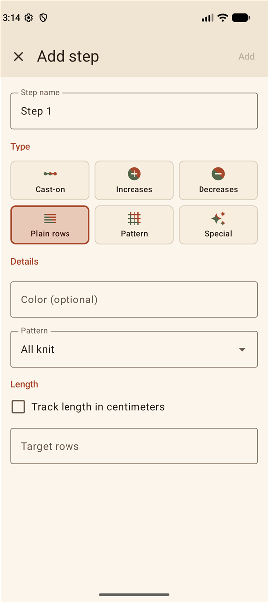
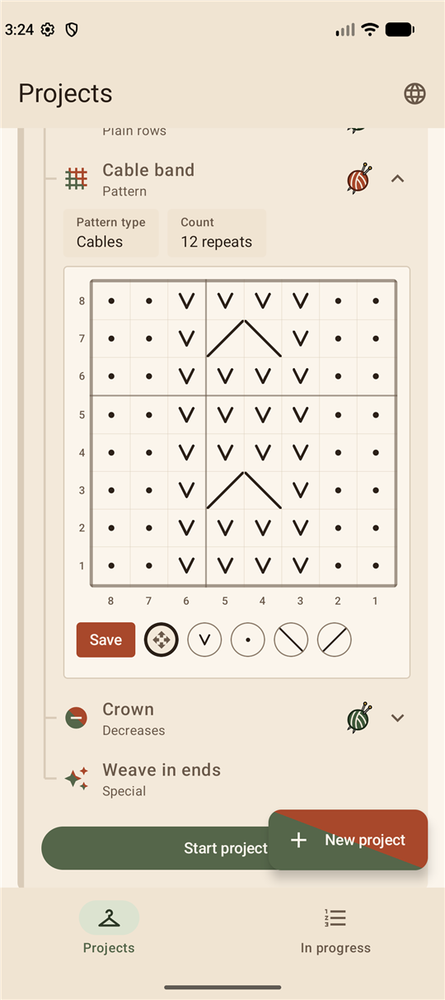

# Knitting

An Android app for planning knitting projects and keeping your place while you knit them. Break a project into steps, chart cable or colorwork patterns, then count stitches, rows and pattern repeats as you go.

<p align="center">
  
  
  
</p>

- [Using the app](#using-the-app)
- [Garmin watch](#garmin-watch)
- [Development](#development)

## Using the app

The app has two tabs. **Projects** is where you plan, and **In progress** is where you knit. The globe icon in the top bar switches the language between English, German (Deutsch) and the system default. The watch icon next to it sets up the [Garmin watch](#garmin-watch) remote.

### Life of a project

Every project moves through three states:

**Created → In progress → Finished**

| State | What you can do |
| --- | --- |
| **Created** | Plan the project: edit its details and steps, chart pattern grids. Nothing is counted yet. |
| **In progress** | Knit it on the *In progress* tab and count your progress. You can still edit the project. |
| **Finished** | A completed project, stamped with its completion date. It stays in the Projects tab and can no longer be edited. |

### Creating a project



1. On the **Projects** tab, tap **New project**.
2. Give it a name and, if you like, a description.
3. Add steps with **Add step** (see below). You can also add them later by editing the project.
4. Tap **Add**.

The new project appears as a card in the *Created* state. Tap the pencil icon on a card to edit its name, description and steps, or to delete the project.

<br clear="right">

<p align="center">
  
  
</p>

### Steps

A project is a list of steps, worked top to bottom. Every step has a name, an optional yarn color and one of six types:

| Type | What it tracks |
| --- | --- |
| **Cast-on** | A number of stitches, plus an optional method (e.g. long-tail) and needle size. |
| **Increases** | A number of increases, plus an optional note on where they go (e.g. "every 4th row"). |
| **Decreases** | A number of decreases, plus an optional note on where they go. |
| **Plain rows** | A number of rows, or a length in centimeters, worked in all knit, all purl, 1K1P or 2K2P ribbing. |
| **Pattern** | A number of repeats of a charted pattern, or a length in centimeters. See [Pattern grids](#pattern-grids). |
| **Special** | Anything else, such as "Weave in ends". It is simply checked off. |

For plain rows and patterns you can tick **Track length in centimeters** to count the section by length instead of by rows or repeats.

Type a yarn color such as *Forest green* or *Terracotta* and the app shows a small yarn ball in that shade next to the step. It recognizes common English and German color names (red/rot, navy/marine, sage/salbei and so on). Any other text is kept and shown as plain text.

Tap the arrow on a card's step summary to see its steps. Tap a step to see its details.

### Pattern grids

A pattern step has a grid of up to 50 × 50 cells that you chart while the project is still in the *Created* state. Open a pattern step on the project card and tap **Edit**, then pick a tool from the toolbar under the grid:



- **Cables** patterns use four stitch symbols: **knit**, **purl**, **cross left** and **cross right**.
- **Colorwork** patterns use up to three colors, plus an eraser.
- **Move grid** pans the grid. Pinch to zoom, which is useful for large charts.
- Tap a cell to paint it, or drag to paint a whole row or column.
- Heavier lines mark every 5th and 10th cell, counted from the bottom right like the axis numbers, so large charts are easy to count.
- **Copy grid from…** reuses the grid of another step in the same project.

Tap **Save** when you are done. The saved grid shows which colors it uses.

<br clear="right">

### Knitting a project

1. On the **Projects** tab, tap **Start project** on a created project and confirm. It moves to the **In progress** tab.
2. The card shows overall progress at the top. Steps are weighted by how much work they are, so a long stretch of rows moves the bar more than a cast-on does.
3. The **current step** gets the colored panel in the middle of the card. Use its buttons to count: stitches, increases, decreases and rows go up and down in steps that suit the step, and a special step is checked off with **Done**.
4. For a **pattern** step the panel shows the grid. Count the rows of the current repeat with the row counter under it. Rows you have knitted are darkened, and the last row completes the repeat and starts the next one.
5. When a step is complete, the next one takes its place. Earlier steps are collected under **Previous steps**, upcoming ones under **Next steps**. Expand either to review or correct them.
6. When every step is done, **Finish** lights up. Tap it and confirm to mark the project finished. Today is saved as its completion date.

**Reset** takes a project back to *Created* and clears its step progress. You can then plan or restart it.

Your projects are stored only on your phone. There is no account, no sync and no network access.

## Garmin watch

A Garmin Forerunner 745 can count for you, so you don't have to put your knitting down to tap the phone. The watch app is a remote control: the phone keeps all the counters, and the watch shows the current step and sends your taps to it. They talk through the Garmin Connect app, so that has to be installed on the phone and the watch paired with it.

### Setting it up

1. Install the watch app on the watch (see [Installing the watch app](#installing-the-watch-app)).
2. In the Knitting app, tap the watch icon in the top bar and switch on **Control counters from a Garmin watch**. Android asks to show notifications; the app shows one while the remote is active.
3. The menu shows the state of the link: *Watch connected*, *Watch not in range*, *No paired Garmin watch found* or a hint to install or update Garmin Connect. If the link cannot recover, the app stops it and shows why.
4. Open **Knitting** (**Stricken** in German) on the watch.

The remote starts again whenever you open the app while the switch is on. It does not start by itself after a reboot.

### Counting from the watch

The watch works on the **current step**: the first unfinished step with a counter in the most recent project that is in progress. Counting on the phone and on the watch can be mixed freely, and either one updates the other.

| Button | Action |
| --- | --- |
| **START** | Count up |
| **DOWN** | Count back |
| **UP** | Resync with the phone |
| **BACK** | Leave the app |

The screen labels each button, and the labels show how much a tap changes the count.

- Taps do what the **+** and **−** buttons of the step do in the app: 10 stitches for a cast-on, a whole centimeter for a step tracked by length, otherwise one. Near the target a tap only adds what is left, and counting back removes a partial amount first.
- On a **pattern** step the watch shows the rows of the current repeat as the big number and the repeats (or the length) below it. Taps only count rows. Repeats are completed by the last row, as in the app.
- Counting back from the very start of a step continues on the previous step, so a mistaken extra tap is easy to undo across steps.
- The watch buzzes briefly on each count and for longer when a step reaches its target.

### Installing the watch app

The watch app lives in `garmin/` and is not published to the Connect IQ store. Build it with the [Connect IQ SDK](https://developer.garmin.com/connect-iq/sdk/) (9.2 or newer, with the Forerunner 745 device files) and a developer key, which the Monkey C extension for VS Code or `openssl` can create. Keep the key out of the repository:

```
cd garmin
monkeyc -d fr745 -f monkey.jungle -o bin/KnittingCounter.prg -y <path to developer_key.der> -w
```

Then connect the watch over USB, copy `KnittingCounter.prg` into `GARMIN/Apps` on the watch and disconnect it. The watch loads the app when it is unplugged.

## Development

### Tech stack

- Kotlin, Jetpack Compose and Material 3
- Room for local storage
- The Garmin Connect IQ companion SDK (`com.garmin.connectiq:ciq-companion-app-sdk`) for the watch remote
- Gradle with the Android Gradle Plugin, KSP and version catalogs (`gradle/libs.versions.toml`)
- Min SDK 24, target SDK 37

### Project layout

```
app/src/main/java/com/akreutz/knitting/
├── MainActivity.kt        Entry point
├── data/                  Room database, entities (Project, Step), DAO, enums,
│                          CounterRepository (the counting rules shared by the screens and the watch)
├── watch/                 Garmin remote: message protocol, controller, Connect IQ link, foreground service
└── ui/
    ├── KnittingApp.kt     Scaffold with the top bar and the two tabs
    ├── WatchButton.kt     Top bar menu that switches the watch remote on and off
    ├── navigation/        Tab destinations
    ├── projects/          Both screens, project and step cards, dialogs, pattern grid, view model
    └── theme/             Colors, typography and spacing

garmin/                    The Monkey C watch app (Forerunner 745)
```

Strings live in `app/src/main/res/values/strings.xml` with a German translation in `values-de`. Add new text to both.

### Building

Open the project in Android Studio, or from the command line:

```
./gradlew assembleDebug    # build the debug APK
./gradlew testDebugUnitTest # run the unit tests
./gradlew lint             # run Android lint
```

The debug build installs next to a release build as "Knitting Debug" (application ID `com.akreutz.knitting.debug`).

`install-debug.ps1` builds the debug APK, installs it and launches it. Pass `-Serial <id>` (see `adb devices`) when more than one device or emulator is connected:

```
./install-debug.ps1 -Serial emulator-5554
```

### Release builds

Release signing reads `keystore.properties` in the project root, which is not checked in. It needs the keys `storeFile`, `storePassword`, `keyAlias` and `keyPassword`.

### Watch remote

The phone and the watch exchange small messages through Garmin Connect. The protocol is documented on `WatchProtocol` (`watch/WatchProtocol.kt`): the watch sends `inc`, `dec` or `sync`, and the phone answers with the current step, its counters and the size of one tap. The phone always acts on its own current step, never on one the watch names, so a stale watch cannot change the wrong step.

Only `GarminLink` needs Garmin's SDK. The rest talks to the `WatchLink` interface, which the unit tests replace with a fake. The watch app's `id` in `garmin/manifest.xml` must equal `WATCH_APP_ID` in `GarminLink.kt`.

The counting rules, such as clamping, pattern row rollover and how far a tap moves, are in `data/CounterRepository.kt` and `data/Step.kt` so the buttons in the app and the watch always agree.

### Data

Projects and steps are stored in a local Room database. Schema changes need a real migration: bump the `version` in `KnittingDatabase`, add a `Migration` for the new version and register it with `addMigrations`. Only databases from before version 19 are still wiped on upgrade.

### Screenshots

The images in `docs/screenshots/` were taken on an emulator. When the UI changes noticeably, retake them at the same size.
